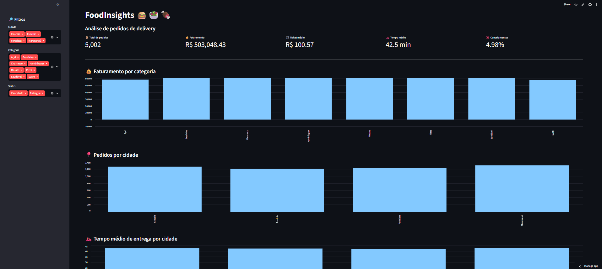
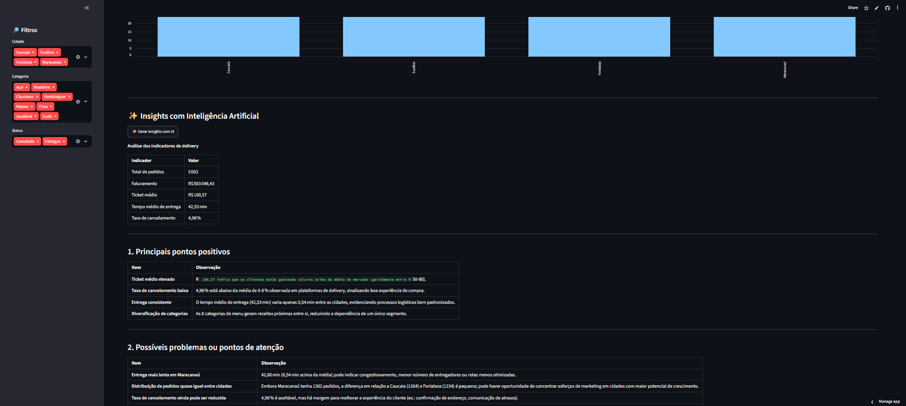

# FoodInsights 🍔📊

> Dashboard interativo para análise de pedidos de delivery utilizando Python, Pandas, SQL, PostgreSQL, Streamlit e Inteligência Artificial.

## 📊 Dashboard





O FoodInsights permite explorar dados de pedidos de delivery através de indicadores, filtros e visualizações interativas.

## ✨ Funcionalidades

- 📦 Análise do volume de pedidos
- 💰 Faturamento e ticket médio
- 🛵 Tempo médio de entrega
- ❌ Taxa de cancelamento
- 📍 Análises por cidade
- 🍔 Análises por categoria
- 🔎 Filtros interativos
- 🤖 Geração de insights utilizando Inteligência Artificial

## 🛠️ Tecnologias

- Python
- Pandas
- SQL
- PostgreSQL
- Supabase
- SQLAlchemy
- Streamlit
- Groq API
- Git e GitHub

## 🏗️ Arquitetura

```text
Pedidos
   ↓
Python + Pandas
   ↓
PostgreSQL / Supabase
   ↓
SQL + Análises
   ↓
Streamlit Dashboard
   ↓
Insights com IA
```

## 🤖 Inteligência Artificial

A aplicação utiliza a API da Groq para analisar os principais indicadores do dashboard e gerar insights voltados à tomada de decisão.

O modelo recebe os resultados calculados a partir dos dados e é orientado a não inventar informações.

## 🚀 Como executar
1. Clone o repositório

```markdown
git clone https://github.com/jlsnogueira247/FoodInsights.git

cd FoodInsights
```
2. Crie e ative o ambiente virtual

```markdown
python -m venv .venv
```
No Windows:

```markdown
.venv\Scripts\Activate.ps1
```

3. Instale as dependências

```markdown
pip install -r requirements.txt
```

4. Configure as variáveis de ambiente

Crie um arquivo **.env**:

```markdown
SUPABASE_DATABASE_URL=sua_connection_string
GROQ_API_KEY=sua_chave
```

⚠️ Nunca compartilhe ou envie o arquivo .env para o GitHub.

5. Execute

```markdown
streamlit run app.py
```

## 🌐 Aplicação online

`Acessar o FoodInsights:` https://foodinsights-uimwzbwxytxvzd2lbjqzuu.streamlit.app/

## 👩‍💻 Autora

**Joana Nogueira**

Estudante de Engenharia de Computação — UNIFOR

Interesses: Análise de Dados • Ciência de Dados • Engenharia de Dados • Python • SQL • Inteligência Artificial